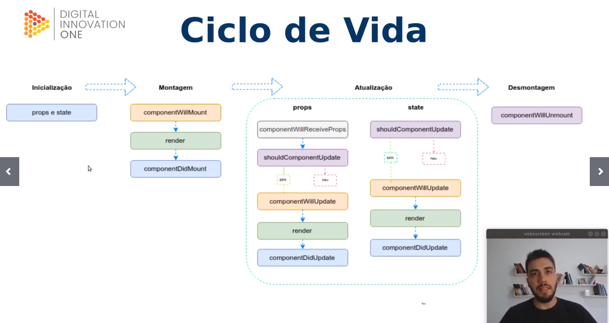

# advanced-reactjs-dio
Curso avançado de ReactJS para a Digital Innovation One

- Inicialização 
- Montagem 
- Atualização 
- Desmontagem 
 

- componentWillmount será depreciado na versão 17 do react 

- toda vez que há atualização de um component, o react reinicia o ciclo 

- react é declarativo existe ou nao existe 

- component  willmount receive props e will update serão depreciados em 17 

mais usados 
- component didmount didupdate didcatch willunmount shouldcomponent update 
pouco usados 
- getderivedstatefromprops
- get snapshotbeforeupdate 

## Exemplos de ciclo de vida 

- ao inves de configurar um por um vamos usar o create-react 

- npx create-react-app nome_app

-Exercício Criar uma app passando por todos os passos do ciclo de vida do React 

## O que são Hooks e Como podem otimizar o código 

Hooks são uma nova adição ao React 16.8 que permitem que você use o state e outros recursos do react sem escrever uma classe 
## Hooks : 
Hooks esperam uma função 
- useState passa por todos os ciclos de vida da aplicação
- useEffect
- useContext
- useReduce
- useCallback
- useMemo
- useRef
- useImperativeHandle
- useLayoutEffect
- useDebugValue

Não use hook dentro de funções Js comuns, ao inves disso você pode 
- chamar hooks em componentes react 
- chamar hooks dentro de hooks customizados 
seguindo estas regras você garante que toda lógica de estado (state ) n ocomponente seja claramente visível no código fonte 

## Context API 

controlamos a utilização de um contexto global <Theme Provider>

muitas vezes nao eh necessario utilizar contexto global 

evitar usar redux em casos não global 

dessa forma (use context) também conseguimos passar informações sem utilizar props 

Design Patterns 
https://tautorn.com.br/javascript-design-patterns/

# Técnicas com components e DOM 

## Por que trabalhar com Fragments ? 

-Fragments : Um padrão comum no React é que um componente pode retornar múltiplos elementos. Os Fragmentos 
permitem agrupar uma lista de filhos sem adicionar nós extras ao DOM 

- Trabalhar sem fragments utilizando diversas divs polui o html do codigo 

 

    

    React A 
    

    

    React B 
    

 

MElhor utilizar fragments 

 <Fragment>
    

    React A 
    

    

    React B 
    

 </Fragment>

ou ainda usando a sintax sugar 

 <>
    

    React A 
    

    

    React B 
    

 </>

## Error Boundaries 

Um erro de Javascript em uma parte da UI não deve quebrar toda a aplicação. Para resolver este problema para usuários do REact , 
na versão 16 temos o novo conseito de error boundary 

import ErrorBoundary from './ErrorBoundary'; /// envolopa a aplicação inteira acima de todo o react 

const main = (
  <ErrorBoundary>
    <App />
  </ErrorBoundary>
)

- a.b retorna undefined 
- a.b.c retorna typeerror cannot read property c of undefined 

dentro de errorboundaries.js podemos tratar os erros 

componentDidCatch(error, errorInfo) {
    this.setState({
      hasError: true
      
    })
  }

error boundaries não capturam erros em 

-manipulação de eventos 
- codigos assincronos (callbacks de settimeout ou requestanimationframe )
- renderização  no server
- erros dentro do próprio eror boundary ao inves de em seus filhos 

## Render props 

o termo render prop se refere a uma técnica de compartilhar código entre componentes React passando uma prop cujo valor é uma função 
Um componente com uam render prop recebe uma função que retorna 
um elemento React e a invoca no momento de renderização, não sendo necessário para o componente implementar uam lógica própria 

criamos um wrapper (counter) que tem dois métodos increment e decrement,  recebe um count com valor inicial o return retorna 
um render , passado pelos counter, que passa o buttons por parâmetro  . Quando buttons for executado , passará os dois métodos para o counter 
mais o count. 

podemos reescrever varios buttons desta forma , parece bastante com o high order component 

## Typechecking usando PropTypes 

Na medida em que sua aplicação cresce, você pode capturar muitos bugs com checagem de tipos. Em algumas aplicações , você pode usar 
extensões do Js como o Flow ou o Typescript para checar os tipos de toda a sua aplicação. Porem , se você não usá-las , React possui algumas habilidades de checagem de tipos nativas 

proptypes não dá erro de compilação , mas somente warning 

PetShop.propTypes = {  /// mesmo nome da classe.proptypes 
  dogs: PropTypes.number.isRequired, /// numero obrigatório
  cats: PropTypes.number,   //// number nao obrigatório 
  customers: PropTypes.array,
  customerName: PropTypes.string.isRequired,
  onClick: PropTypes.func.isRequired,
  status: PropTypes.oneOf(["Completed", "Disabled"])
}

  return (
    <PetShop
      dogs={2}
      customerName="Bruno Carneiro"
      onClick={handleClick}
      status="done"
    />
  )

index.js:1 Warning: Failed prop type: Invalid prop `status` of value `done` supplied to `PetShop`, expected one of ["Completed","Disabled"].
    in PetShop (at App.js:10)
    in App (at src/index.js:7)

o eslint pode obrigar a adicionar o proptypes , é interessante para forçar o desenvolvedor a validar os dados 

## REfs e DOM 

com refs é possivel acessar a árvore do DOM e ou elementos React 

Quando utilizar 
- Manipulação de bibliotecas de terceiros ex: onclick , onchange quando não está retornadando essas funções por callback... 
- gerenciamentos de inputs, foco seleção de textos ou reprodução de mídias 
- animações imperativas 

O que é um Fragmento?

É um padrão do React para um componente retornar múltiplos elementos.

Quantos componentes Error Boundaries podem existir em uma aplicação utilizando React?
Quantos forem necessários, Error Boundary pode ser criado de forma granular.

# Aula 3 Organizando o seu projeto 

